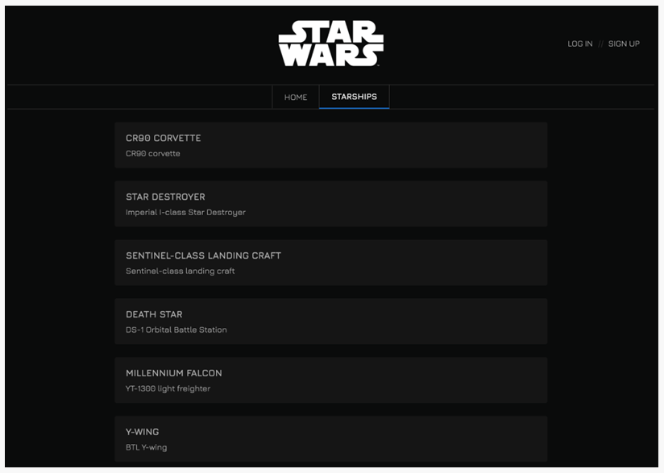
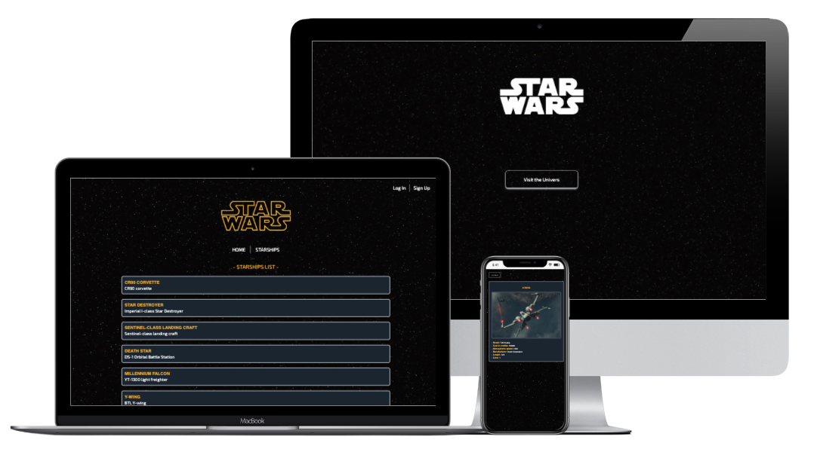

# Star Wars Starship Database

Starship Star Wars database using the Star Wars `API`: https://swapi.dev/

To get the images: https://starwars-visualguide.com/

Built with `React + Vite`.

## 🌐 Live Demo

https://movie-api-git-master-martapla.vercel.app/

##  👩‍🔧 Project Instructions 

This technical test involves: consuming data from an API, displaying it on a screen through a list, and showing the details of each item in the list.

The website you have to develop should display information about Star Wars ships. 
The list of ships with detailed information for each one should be shown.

### 📍 step 1
- The first thing you need to implement is the `main screen` where the entire `list of ships` is displayed.

- Required data for each product (ship) in the list: `ship name and model.`

### 📍 step 2
- Create the `file for each ship`, displaying all its details.

- The user can access the details of each ship by clicking on each one through the list.

### 📍 step 3

- `Implement a button` at the end of the list of ships with the text `"View more"` that allows fetching more ships from the server and adds them to the list of ships shown to the user.

### 📍 step 4
- Change the `styles` as you see fit. 

### 📍 step 5
- Implement a `welcome homepage`, and through a button, users will be able to access the main ships page. 
- You must use `React Router`.

### 📍 step 6
- Implement a `login and registration` screen, using `localstorage`.
- Displaying the login and register result in the console will be satisfactory.

### 📍 step 7
- Implement a `pilot card` with theis respective details. 
- It will be displayed into the file of each ship.

#  🎠 Style

- The UI is design by me and I used `Tailwind Css`. 
- The project is also `fully responsive`, for mobile, tablet and desktop.

